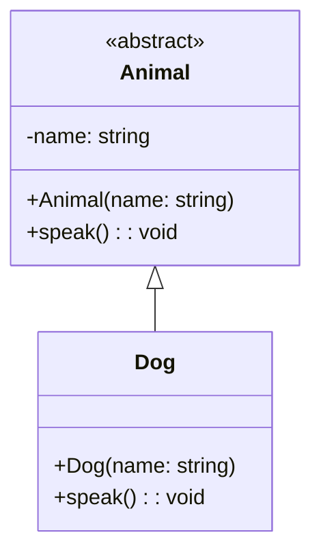

```mermaid
classDiagram
    %% Definición de clases
    class Animal {
        +Animal(name: string)
        <<abstract>>
        +speak(): void
        -name: string
    }
    class Dog {
        +Dog(name: string)
        +speak(): void
    }

    %% Relaciones
    Animal <|-- Dog

```
