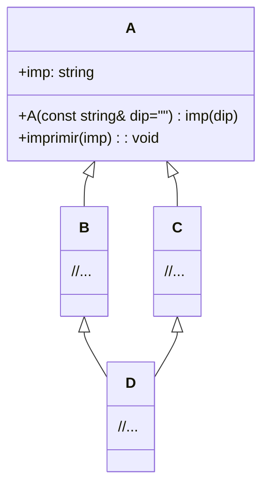

```mermaid
classDiagram
    %% Definición de clases
    
    class A {
        +imp: string
        +A(const string& dip="") : imp(dip)
        +imprimir(imp): void

    }
    class B{
        //...
    }
    
    class C{
        //...
    }
    
    class D{
        //...
    }


    %% Relaciones
    A <|-- B
    A <|-- C
    B <|-- D
    C <|-- D

```