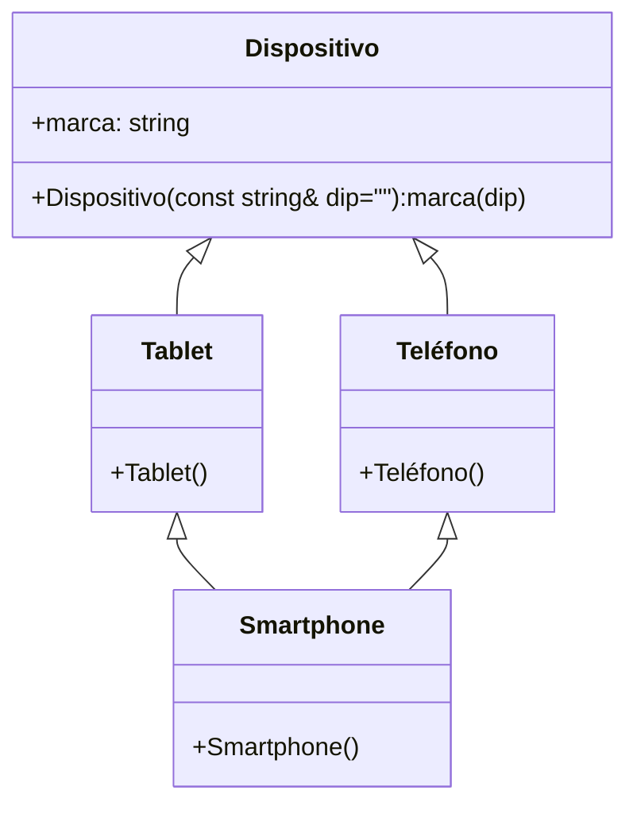

```mermaid
classDiagram
    %% Definición de clases
    
    class Dispositivo {
        +Dispositivo(const string& dip=""):marca(dip)
        +marca: string

    }
    class Tablet{
        +Tablet()
    }

    class Teléfono{
        +Teléfono()
    }

    class Smartphone{
        +Smartphone()
    }

    %% Relaciones
    Dispositivo <|-- Tablet
    Dispositivo <|-- Teléfono
    Tablet <|-- Smartphone
    Teléfono <|-- Smartphone

```