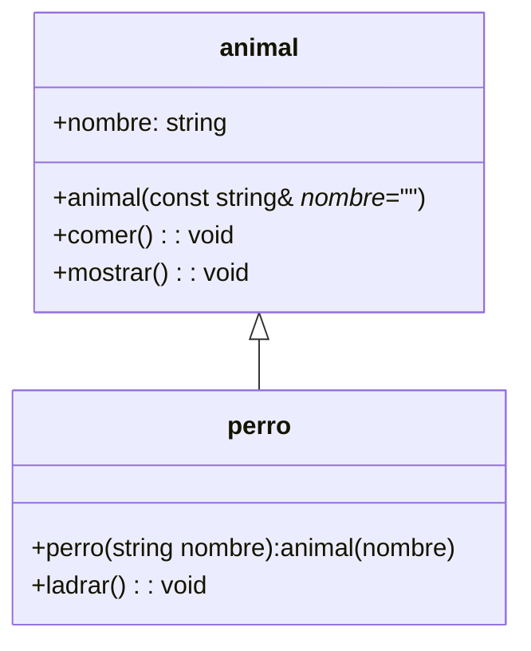

```mermaid
classDiagram
    %% Definición de clases
    
    class animal {
        +animal(const string& _nombre_="")
        +nombre: string
        +comer(): void
        +mostrar(): void

    }
    class perro{
        +perro(string nombre):animal(nombre)
        +ladrar(): void
    }

    

    %% Relaciones
    animal <|-- perro
    

```