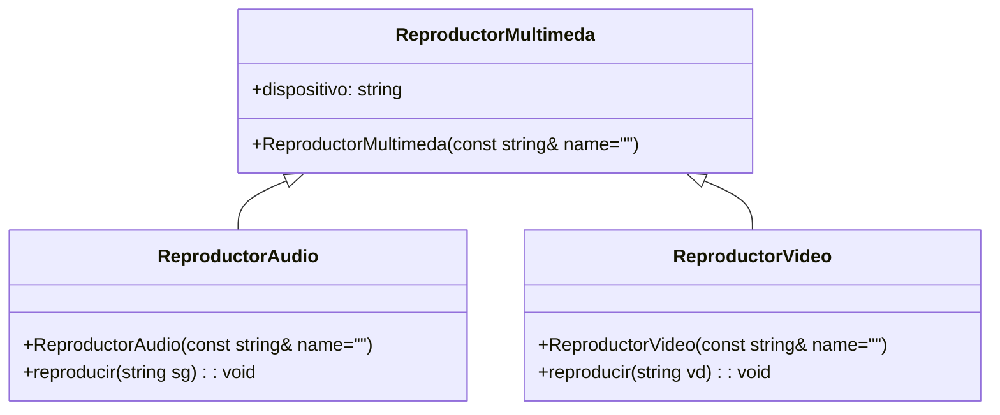

```mermaid
classDiagram
    %% Definición de clases
    
    class ReproductorMultimeda {
        +dispositivo: string
        +ReproductorMultimeda(const string& name="")

    }
    class ReproductorAudio{
        +ReproductorAudio(const string& name="")
        +reproducir(string sg) : void
    }

    class ReproductorVideo{
        +ReproductorVideo(const string& name="")
        +reproducir(string vd) : void
    }

    

    %% Relaciones
    ReproductorMultimeda <|-- ReproductorAudio
    ReproductorMultimeda <|-- ReproductorVideo

```