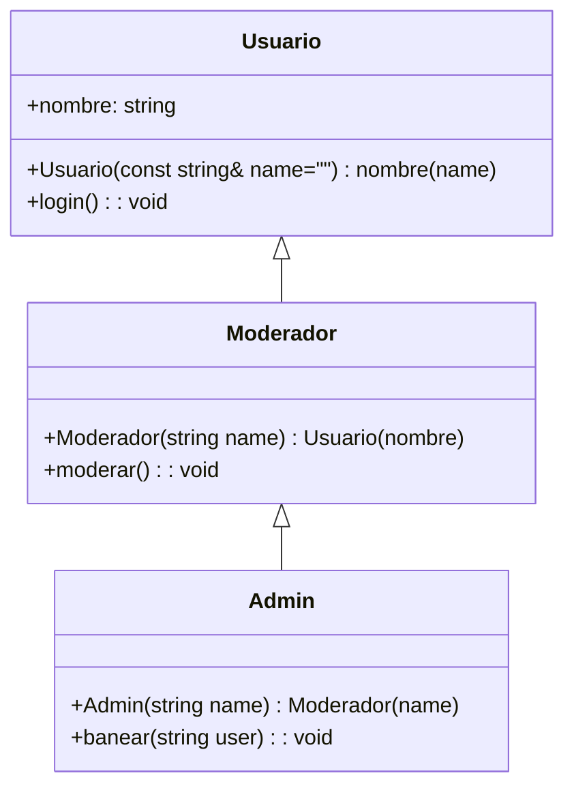

```mermaid
classDiagram
    %% Definición de clases
    
    class Usuario {
        +nombre: string
        +Usuario(const string& name="") : nombre(name)
        +login() : void

    }
    class Moderador{
        +Moderador(string name) : Usuario(nombre)
        +moderar() : void
    }

    class Admin{
        +Admin(string name) : Moderador(name)
        +banear(string user) : void
    }

    

    %% Relaciones
    Usuario <|-- Moderador
    Moderador <|-- Admin

```