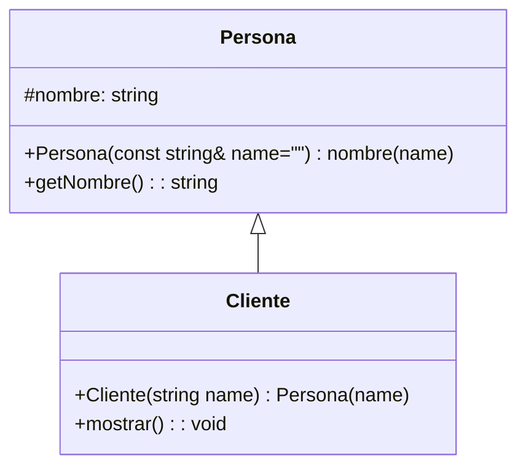

```mermaid
classDiagram
    %% Definición de clases
    
    class Persona {
        #nombre: string
        +Persona(const string& name="") : nombre(name)
        +getNombre(): string

    }
    class Cliente{
        +Cliente(string name) : Persona(name)
        +mostrar() : void
    }
    

    %% Relaciones
    Persona <|-- Cliente

```