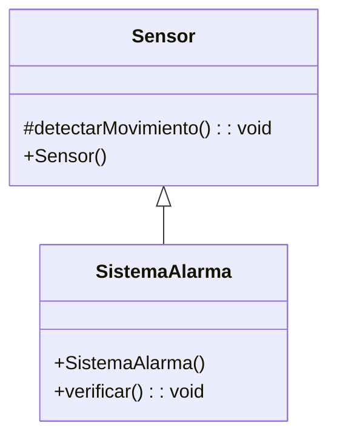

```mermaid
classDiagram
    %% Definición de clases
    
    class Sensor {
        #detectarMovimiento() : void
        +Sensor()

    }
    class SistemaAlarma{
        +SistemaAlarma()
        +verificar() : void
    }
    

    %% Relaciones
    Sensor <|-- SistemaAlarma

```