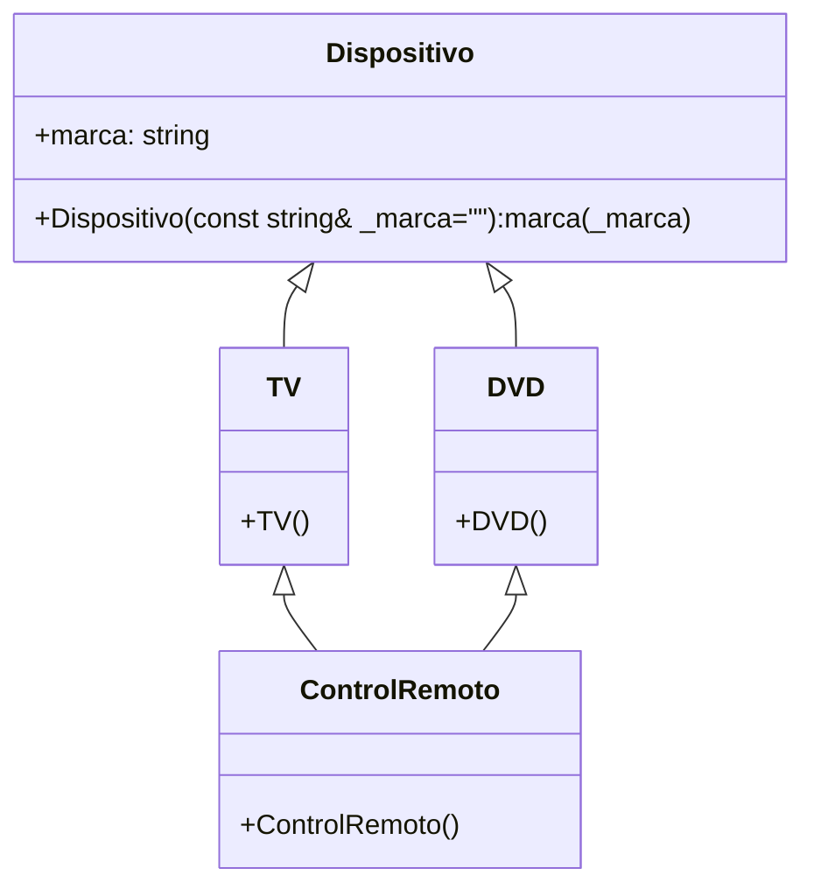

```mermaid
classDiagram
    %% Definición de clases
    
    class Dispositivo {
        +marca: string
        +Dispositivo(const string& _marca=""):marca(_marca)
    }

    class TV{
        +TV()
    }

    class DVD{
        +DVD()
    }

    class ControlRemoto{
        +ControlRemoto()
    }

    %% Relaciones
    Dispositivo <|-- TV
    Dispositivo <|-- DVD
    TV <|-- ControlRemoto
    DVD <|-- ControlRemoto

```