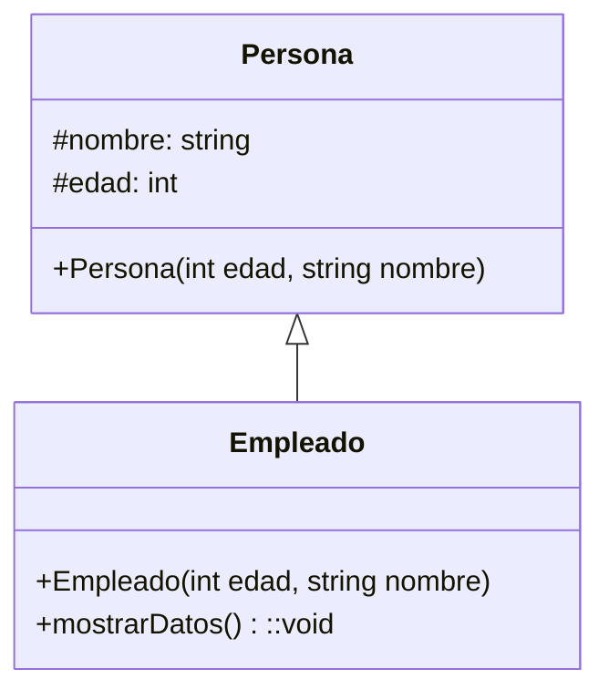

```mermaid
classDiagram
    %% Definición de clases
    
    class Persona {
        #nombre: string
        #edad: int
        +Persona(int edad, string nombre)

    }
    class Empleado{
        +Empleado(int edad, string nombre)
        +mostrarDatos()::void
    }

    

    %% Relaciones
    Persona <|-- Empleado
    

```